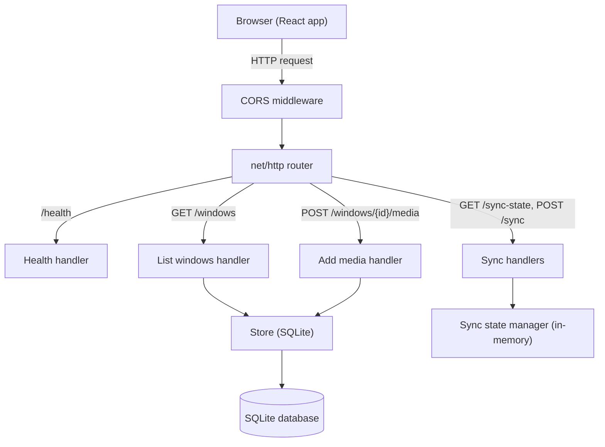
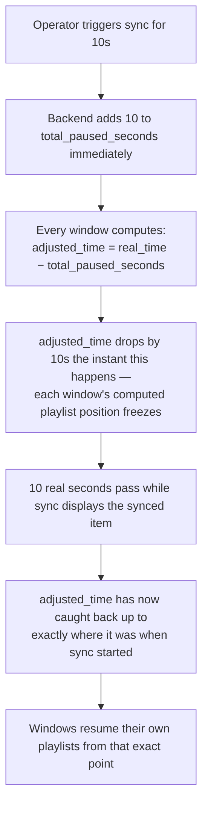

# Signal Wall — Multi-Window Media Sequencer with Sync Playback

A full-stack application where multiple display windows continuously play
their own configured media sequence, support dynamic playlist changes, and
can be "synced" so every window briefly shows the same item at the same
time before resuming exactly where it left off.

Backend: Go + SQLite. Frontend: React (Vite).

---

## Live Links

| What | URL |
|---|---|
| Backend API | _to be added after deployment_ |
| Public health check | _to be added after deployment_ |
| Frontend | _to be added after deployment_ |
| GitHub repo | _add your repo URL here_ |

---

## How It Works

**Continuous playback (no network calls needed):** each window's playlist
is fetched once and then played entirely by client-side math — the
browser computes "what should be on screen right now" from elapsed time,
with no repeated polling required just to keep playing.

**The 5-hour cycle:** every window is treated as looping within an
18,000-second (5-hour) window. In practice this means: take the current
time, reduce it to "position within the current 5-hour cycle," then
reduce that further to "position within one pass of this window's own
playlist" to find the current item. At the exact 5-hour boundary,
position snaps back to zero — the playlist restarts from item one,
regardless of what was playing — matching the assignment's own wording,
"restarts its media list after the sequence ends."

**Dynamic updates:** adding media calls `POST /windows/{id}/media`; the
frontend re-fetches the window list periodically (every 8 seconds) so new
items appear without a manual refresh.

**Sync, and why it truly pauses (not skips):** triggering a sync doesn't
just tell every window to display an item — it also adds the sync's full
duration to a running total (`total_paused_seconds`) on the backend.
Every window subtracts that running total from its own elapsed-time
calculation before computing its position. The instant that total
increases, every window's computed position jumps backward by exactly the
sync duration, then ticks forward normally — arriving back at the
pre-sync position only once the sync's real-world duration has actually
elapsed. The net effect: playback truly freezes during a sync and resumes
from the exact same point afterward, with no per-window bookkeeping
needed — one shared number, subtracted everywhere.

**Why polling, not WebSockets:** the sync feature only needs to feel
responsive to a human watching multiple screens — a delay of up to one
second is imperceptible in that context. Polling `/sync-state` once a
second gets that result with dramatically less complexity than a
WebSocket connection registry, reconnect-on-drop handling, and server-side
broadcast logic would require. At a larger scale (many more windows, more
frequent syncs), WebSockets or Server-Sent Events would be worth
revisiting — this was a deliberate trade-off for this scope, not an
oversight.

---

## Architecture



## Data Flow Diagram


The two polling loops on the right are intentionally separate: playlist
data changes rarely (only when an operator adds media), so it's fetched
infrequently; sync state needs to feel responsive, so it's checked every
second.

## Sync Pause Logic



---

## Folder Structure

```
media-sequencer/
├── main.go                        # Entry point: wires store, sync manager, routes
├── go.mod / go.sum
├── Dockerfile                      # Multi-stage build for the Go backend
├── .dockerignore
├── .env.example                    # DB_PATH, PORT
├── internal/
│   ├── models/
│   │   └── models.go                # Window, MediaItem structs; CycleSeconds constant
│   ├── store/
│   │   └── store.go                 # SQLite access layer + seed data
│   ├── syncstate/
│   │   └── syncstate.go             # In-memory sync state, pause/resume logic
│   ├── middleware/
│   │   └── cors.go                  # Allows the React app to call the API
│   └── handlers/
│       ├── handlers.go              # All endpoint handlers
│       └── response.go              # Shared JSON response helpers
└── frontend/
    ├── index.html
    ├── package.json
    ├── vite.config.js
    ├── .env.example                 # VITE_API_BASE
    ├── public/
    │   ├── favicon.svg
    │   └── icons.svg
    └── src/
        ├── main.jsx                  # React entry point
        ├── App.jsx                   # Top-level state, polling loops, layout
        ├── index.css                 # Design system (dark, broadcast-monitor aesthetic)
        ├── api.js                    # Fetch wrappers for the backend
        ├── playback.js               # Pure function: elapsed time → current item
        └── components/
            ├── WindowTile.jsx        # Renders one window: media, progress, countdown
            ├── MediaFrame.jsx        # Renders image / video / blank
            ├── AddMediaForm.jsx      # Add-media control
            └── SyncForm.jsx          # Trigger-sync control
```

---

## API Endpoints

No authentication — not required by the assignment brief, and there's no
concept of per-user data here (windows are shared, operator-facing
infrastructure, not personal accounts).

| Method | Endpoint | Purpose |
|---|---|---|
| GET | `/health` | Health check |
| GET | `/windows` | List all windows with their playlists, plus `server_time` and `cycle_seconds` |
| POST | `/windows/{id}/media` | Append a new item to a window's playlist |
| GET | `/sync-state` | Current sync status — polled by every window |
| POST | `/sync` | Trigger a synced moment across all windows |

### Example requests

**List windows**
```
curl http://localhost:8080/windows
```
Returns `{"server_time": "...", "cycle_seconds": 18000, "windows": [...]}`.

**Add media to a window**
```
curl -X POST http://localhost:8080/windows/1/media \
  -H "Content-Type: application/json" \
  -d '{"type":"image","url":"https://example.com/photo.jpg","duration_seconds":6}'
```
`type` is `image`, `video`, or `blank`. `url` is not required for `blank`.

**Check sync state**
```
curl http://localhost:8080/sync-state
```
Returns `{"active": false}` normally, or
`{"active": true, "type": "image", "url": "...", "ends_at": "...", "total_paused_seconds": 10}`
while a sync is active.

**Trigger a sync**
```
curl -X POST http://localhost:8080/sync \
  -H "Content-Type: application/json" \
  -d '{"type":"image","url":"https://example.com/sync-item.jpg","duration_seconds":10}'
```

---

## Running Locally

### Backend
```
cd media-sequencer
go get modernc.org/sqlite
go mod tidy
cp .env.example .env
go run main.go
curl http://localhost:8080/health
```

### Frontend
```
cd media-sequencer/frontend
cp .env.example .env       # set VITE_API_BASE if not using localhost:8080
npm install
npm run dev
```
Open the local URL Vite prints (typically `http://localhost:5173`).

## Running the Backend with Docker
```
docker build -t media-sequencer .
docker run -p 8080:8080 media-sequencer
curl http://localhost:8080/health
```

---

## Assumptions

- **Polling over WebSockets** for sync-state, given the latency tolerance
  of this use case — see "Why polling, not WebSockets" above.
- **Sync truly pauses, not skips, normal playback** — a deliberate design
  decision (see "Sync Pause Logic" above), interpreting the brief's
  "continue its own normal sequence without losing its playlist
  configuration" as resuming from the exact interrupted position, not
  wherever elapsed time would otherwise place it.
- **Sync state lives in memory, not the database.** It's short-lived
  coordination state (what to show right now, for the next few seconds),
  not data that needs to survive a server restart — persisting it would
  add complexity without a corresponding benefit. Window/media data,
  which does need to persist, is stored in SQLite.
- **`duration_seconds` is admin-configured, independent of actual media
  length.** A video plays (looped, muted, autoplaying) for however long
  its playlist entry specifies, regardless of the video file's own
  runtime — this matches the brief's framing of duration as a property of
  the playlist slot, not the file.
- **The 5-hour cycle boundary is a hard reset**, matching the brief's
  wording ("restarts its media list") rather than a seamless loop — see
  "How It Works" above for the exact mechanics.
- **No authentication.** Not required by the brief, and there's no
  per-user data model here — windows are shared operator infrastructure.
- **CORS is permissive** (`Access-Control-Allow-Origin: *`), matching the
  scope of this assignment rather than a production multi-tenant service.
