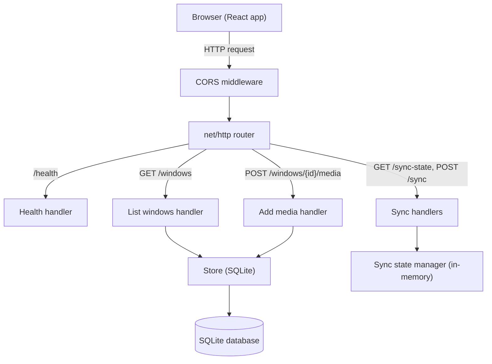
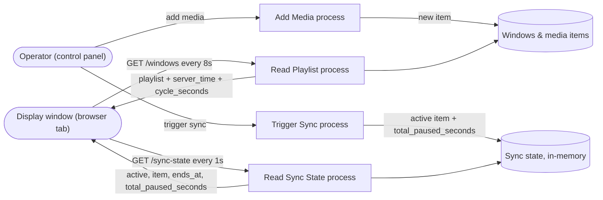
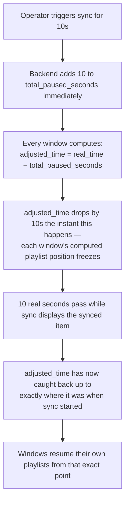

# Signal Wall — Multi-Window Media Sequencer with Sync Playback

## What this is, in plain terms

Imagine a wall of screens in a store or lobby. Each screen loops its own
playlist of images and videos, over and over, completely independently of
the others. There's also one special button: **Sync**. Press it, and every
screen instantly switches to show the exact same thing at the same time —
like a store manager cutting to a "Sale starts now!" announcement across
every screen at once. A few seconds later, every screen quietly goes back
to whatever it was doing before, picking up exactly where it left off, as
if the interruption never happened.

This project is that system: a backend that stores each screen's playlist
and coordinates the sync moment, and a frontend that actually displays the
screens and lets an operator add media or trigger a sync.

**Backend:** Go, with data saved permanently in a SQLite database.
**Frontend:** React, styled like real broadcast-monitor software.

---

## Try It Right Now

These are live, clickable links — no setup required to see it working.

| What | Link |
|---|---|
| **Live app (the screen wall itself)** | https://media-sequencer-2.onrender.com |
| Backend health check | https://media-sequencer-rluh.onrender.com/health |
| Backend raw data (all windows + playlists) | https://media-sequencer-rluh.onrender.com/windows |
| GitHub repository | https://github.com/Harshul017/media-sequencer |

Opening the live app link shows 3 windows already looping real seeded
content. Try the "Add media" and "Trigger sync" controls on the right —
they talk to the real, live backend.

---

## How It Actually Works

### Each window loops on its own, without asking the backend anything

Every window's playlist is fetched once. From there, the browser
continuously calculates "what should be showing right now" using nothing
but the current time and simple math — no repeated requests needed just
to keep something playing. This is why playback stays smooth even if the
network briefly hiccups.

### The "5-hour cycle"

The assignment treats each window's total play span as 5 hours (18,000
seconds) before its playlist is considered to "restart." In practice:
take the current time, find the position within the current 5-hour
window, then find the position within one pass of that window's own
playlist — that tells the browser exactly which item to show. At the
exact 5-hour mark, the position resets to zero and the playlist starts
over from item one, regardless of what was showing — matching the
assignment's own wording that each window "restarts its media list after
the sequence ends."

### How Sync works, and why it truly pauses instead of skipping

When someone triggers a sync, the backend does two things at once:
records "show this item for N seconds," and adds that N seconds to a
running total of "time ever spent in sync." Every window subtracts that
running total from its own clock before computing its position. The
moment that total increases, every window's computed position jumps
backward by exactly N seconds — effectively freezing it — and only
catches back up to the real time once N real seconds have actually
passed. The result: when sync ends, each window resumes from the *exact
same spot* it was interrupted at, not wherever it would have organically
drifted to. See the diagram below for the exact mechanics.

### Why polling instead of WebSockets

Every window checks "is a sync happening?" once per second, rather than
keeping an always-open connection to the server (the WebSocket approach).
A human watching multiple screens cannot perceive a delay of up to one
second as broken — it reads as instant. Polling achieves that same
practical result with far less code and far fewer ways to fail (no
dropped-connection handling, no reconnect logic) than WebSockets would
require. At a much larger scale — hundreds of windows, frequent syncs —
WebSockets would become worth that added complexity; for this scope, it
wasn't.

---

## Architecture



## Data Flow Diagram



The two polling loops on the right are intentionally separate: playlist
data changes rarely (only when an operator adds media), so it's checked
infrequently; sync state needs to feel responsive, so it's checked every
second.

## Sync Pause Logic



---

## Folder Structure

```
media-sequencer/
├── main.go                        # Entry point: wires store, sync manager, routes
├── go.mod / go.sum
├── Dockerfile                      # Multi-stage build for the Go backend
├── .dockerignore
├── .env.example                    # DB_PATH, PORT
├── internal/
│   ├── models/
│   │   └── models.go                # Window, MediaItem structs; CycleSeconds constant
│   ├── store/
│   │   └── store.go                 # SQLite access layer + seed data
│   ├── syncstate/
│   │   └── syncstate.go             # In-memory sync state, pause/resume logic
│   ├── middleware/
│   │   └── cors.go                  # Allows the React app to call the API
│   └── handlers/
│       ├── handlers.go              # All endpoint handlers
│       └── response.go              # Shared JSON response helpers
└── frontend/
    ├── index.html
    ├── package.json
    ├── vite.config.js
    ├── .env.example                 # VITE_API_BASE
    ├── public/
    │   ├── favicon.svg
    │   └── icons.svg
    └── src/
        ├── main.jsx                  # React entry point
        ├── App.jsx                   # Top-level state, polling loops, layout
        ├── index.css                 # Design system (dark, broadcast-monitor aesthetic)
        ├── api.js                    # Fetch wrappers for the backend
        ├── playback.js               # Pure function: elapsed time → current item
        └── components/
            ├── WindowTile.jsx        # Renders one window: media, progress, countdown
            ├── MediaFrame.jsx        # Renders image / video / blank
            ├── AddMediaForm.jsx      # Add-media control
            └── SyncForm.jsx          # Trigger-sync control
```

---

## API Endpoints

No authentication — not required by the assignment brief, and there's no
concept of per-user data here (windows are shared, operator-facing
infrastructure, not personal accounts).

| Method | Endpoint | Purpose |
|---|---|---|
| GET | `/health` | Health check |
| GET | `/windows` | List all windows with their playlists, plus `server_time` and `cycle_seconds` |
| POST | `/windows/{id}/media` | Append a new item to a window's playlist |
| GET | `/sync-state` | Current sync status — polled by every window |
| POST | `/sync` | Trigger a synced moment across all windows |

### Try these against the live backend

**List windows** (open directly in a browser, or curl):
```
curl https://media-sequencer-rluh.onrender.com/windows
```
Returns `{"server_time": "...", "cycle_seconds": 18000, "windows": [...]}`.

**Add media to a window:**
```
curl -X POST https://media-sequencer-rluh.onrender.com/windows/1/media \
  -H "Content-Type: application/json" \
  -d '{"type":"image","url":"https://picsum.photos/seed/example/800/450","duration_seconds":6}'
```
`type` is `image`, `video`, or `blank`. `url` is not required for `blank`.

**Check sync state:**
```
curl https://media-sequencer-rluh.onrender.com/sync-state
```
Returns `{"active": false}` normally, or
`{"active": true, "type": "image", "url": "...", "ends_at": "...", "total_paused_seconds": 10}`
while a sync is active.

**Trigger a sync:**
```
curl -X POST https://media-sequencer-rluh.onrender.com/sync \
  -H "Content-Type: application/json" \
  -d '{"type":"image","url":"https://picsum.photos/seed/synctest/800/450","duration_seconds":10}'
```
Open the live app link above in a browser tab first, then run this — you'll
see every window switch over within about a second.

---

## Running Locally

### Backend
```
cd media-sequencer
go get modernc.org/sqlite
go mod tidy
cp .env.example .env
go run main.go
curl http://localhost:8080/health
```

### Frontend
```
cd media-sequencer/frontend
cp .env.example .env       # set VITE_API_BASE if not using localhost:8080
npm install
npm run dev
```
Open the local URL Vite prints (typically `http://localhost:5173`).

## Running the Backend with Docker
```
docker build -t media-sequencer .
docker run -p 8080:8080 media-sequencer
curl http://localhost:8080/health
```

## Deployment

Both services are deployed on Render's free tier:
- **Backend** — deployed as a Web Service from the Dockerfile at the repo
  root. Health check path set to `/health`.
- **Frontend** — deployed as a Static Site, with root directory
  `frontend`, build command `npm ci && npm run build`, publish directory
  `dist`, and one environment variable: `VITE_API_BASE` set to the
  deployed backend's URL.

---

## Assumptions

- **Polling over WebSockets** for sync-state, given the latency tolerance
  of this use case — see "How It Actually Works" above.
- **Sync truly pauses, not skips, normal playback** — a deliberate design
  decision, interpreting the brief's "continue its own normal sequence
  without losing its playlist configuration" as resuming from the exact
  interrupted position, not wherever elapsed time would otherwise place
  it. See the "Sync Pause Logic" diagram for the exact mechanism.
- **Sync state lives in memory, not the database.** It's short-lived
  coordination state (what to show right now, for the next few seconds),
  not data that needs to survive a server restart — persisting it would
  add complexity without a corresponding benefit. Window and media data,
  which does need to persist, is stored in SQLite.
- **`duration_seconds` is admin-configured, independent of actual media
  length.** A video plays (looped, muted, autoplaying) for however long
  its playlist entry specifies, regardless of the video file's own
  runtime — this matches the brief's framing of duration as a property of
  the playlist slot, not the file.
- **The 5-hour cycle boundary is a hard reset**, matching the brief's
  wording ("restarts its media list") rather than a seamless loop — see
  "How It Actually Works" above for the exact mechanics.
- **No authentication.** Not required by the brief, and there's no
  per-user data model here — windows are shared operator infrastructure.
- **CORS is permissive** (`Access-Control-Allow-Origin: *`), matching the
  scope of this assignment rather than a production multi-tenant service.
- **Render free-tier trade-offs**, documented rather than hidden: the
  backend has no persistent disk, so the SQLite database resets on
  redeploy or restart; and the free web service spins down after ~15
  minutes of inactivity, so the first request after a gap can take
  20–50 seconds while it wakes back up.
